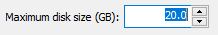
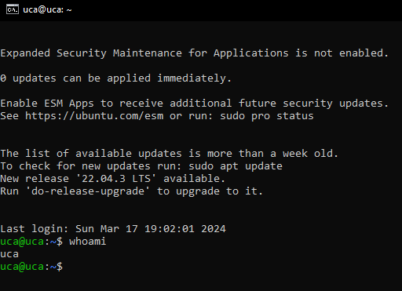

# <a name="_an3iuyhamuij"></a>**Universidad Centroamericana José Simeón Cañas**


#

# <a name="_ynzxo6dwj93y"></a><a name="_3npbchbhyyco"></a>**Ciclo 01/2024, Laboratorio: Entornos de desarrollo web con Docker.**

### <a name="_222lste8cqqv"></a>**Catedrática: Elisa Aldana**

### <a name="_87cf60580t2d"></a>**2024, Antiguo Cuscatlan**

  
  
  

## <a name="_f9gbxv73pqyj"></a>¿Qué es Docker?

  


  

Docker es una plataforma de software que permite crear, probar e implementar aplicaciones rápidamente. Docker empaqueta software en unidades estandarizadas llamadas contenedores que incluyen todo lo necesario para que el software se ejecute, incluidas bibliotecas, herramientas de sistema, código y tiempo de ejecución. Con Docker, puede implementar y ajustar la escala de aplicaciones rápidamente en cualquier entorno con la certeza de saber que su código se ejecutará.

  

## <a name="_1oo0ntz3mlw1"></a>**Conceptos básicos**

**Imágenes**

Una imagen es una especie de plantilla, una captura del estado de un contenedor. Se podría decir que una imagen de un contenedor es como un snapshot de una máquina virtual, pero mucho mucho más ligero. Por ejemplo una imagen podría contener un sistema operativo Ubuntu con un servidor Apache y tu aplicación web instalada. Las imágenes se utilizan para crear contenedores, y nunca cambian.

  
  

**DockerFile**

Es un archivo de configuración que se utiliza para crear imágenes. En dicho archivo se indica qué es lo que queremos que tenga la imagen, y los distintos comandos para instalar las herramientas.

  

**Containers**

Un contenedor de Docker es una instancia en ejecución de una imagen de Docker. Sin embargo, a diferencia de la virtualización tradicional con un hipervisor de tipo 1 o tipo 2, un contenedor de Docker se ejecuta en el núcleo del sistema operativo host.

  

**Volúmenes**

No es una buena práctica guardar los datos persistentes dentro de un contenedor de Docker. Para eso están los volúmenes, fuera de los contenedores. Así se puede crear y borrar contenedores sin preocuparse por que se borren los datos.

Además los volúmenes se utilizan para compartir datos entre contenedores.

  
  

**Links**

Sirven para enlazar contenedores entre sí, que están dentro de una misma máquina, sin exponer a los contenedores cuáles son los datos de la máquina que los contiene.

  

## <a name="_d5vd88qpsmlu"></a>**¿Para qué nos sirve Docker?**

**Desarrollo y pruebas de aplicaciones:** Docker proporciona entornos de desarrollo consistentes y reproducibles, simplificando el proceso de desarrollo y prueba de aplicaciones.

  

**Despliegue de aplicaciones:** Docker facilita el despliegue rápido y eficiente de aplicaciones en diferentes entornos, desde servidores locales hasta la nube.

  

**Microservicios y arquitecturas distribuidas:** Docker es popular para empaquetar servicios como contenedores independientes, lo que simplifica la gestión y escalabilidad de sistemas distribuidos, especialmente cuando se combina con herramientas de orquestación como Kubernetes.

  

## <a name="_g3mkk6l6a75m"></a>**Comandos básicos de Docker**

  
|Comando|Definicion  |
|--|--|
| **sudo docker ps - a** | Este comando se utiliza para ver todos los contenedores en ejecución actualmente. |
| **sudo docker images** | Este comando se utiliza para ver todas las imágenes de Docker disponibles en el sistema. |
| **sudo docker rm** | Este comando se utiliza para eliminar un contenedor que ya no se necesita. Por ejemplo, docker rm my\_container eliminará el contenedor llamado “my\_container”. |
|**sudo docker build**|Este comando se utiliza para construir una imagen personalizada a partir de un archivo Dockerfile.|
|**sudo docker exec**|Este comando se utiliza para ejecutar un comando dentro de un contenedor en ejecución. Por ejemplo, docker exec my\_container ls -l ejecutará el comando “ls -l” dentro del contenedor llamado “my\_container”.|
|**sudo docker-compose**|Este comando se utiliza para orquestar múltiples contenedores y sus dependencias en un entorno de aplicación más grande.|
|**sudo docker logs**|Este comando se utiliza para ver los registros de un contenedor. Puede ver los registros de un contenedor específico utilizando su ID o su nombre.|

  
  
  

#

#

# <a name="_kw00toz0xrfl"></a><a name="_k05p44uzmi66"></a><a name="_4nme9m9fgsdh"></a>**Creación de la máquina virtual**

  
  


  
  

Empezaremos creando una máquina virtual usando VMware (programa que te permite crear y usar varias computadoras virtuales en una sola computadora real)

  
  
  

Abrimos VMware y creamos una nueva máquina virtual

  
  
  


  

click en instaler disk image iso, y en browser buscamos nuestra imagen iso, alojada en el escritorio (En nuestro caso será la de ubuntu server)

  


  

pondremos “uca” como nombre y usuario y “12345” como contraseña

  


  

dejamos el nombre por defecto

  


  

tamaño por defecto(20GB)

  



  

una vez configurado todo deberíamos tener una información de nuestra MV asi

  


  

Al dar “Finish” se iniciara la imagen de Ubuntu Server y comenzará la instalación de esta en nuestra “Computadora virtual”

###

  
  
  
  
  

###

### <a name="_hsphortsz2q9"></a><a name="_mkaku9z2xses"></a><a name="_y42j87fb2lv7"></a>**Configuración de la máquina virtual**

Seleccionamos el idioma inglés

  


  

daremos click en “Continue without updating” (esto es así por cuestiones de tiempo)

  


  
  

click en “Done”, dejaremos el teclado en ingles

  


  

anotamos la ip que se asigna en nuestra instalación, luego de eso continuaremos dando click en “Done”

  


  

dejamos en blanco el proxy address

  


  
  

cambiamos SV por CO, esto debido a que utilizaremos el servidor de colombia

  


  
  
  
  
  
  

nos aseguramos que esten marcadas estas opciones

  


  

luego le daremos click en “Done”

  


  
  
  

click en “Continue”

  


  

Para efectos prácticos, llenaremos este formulario con los siguientes datos

  

Name: uca

  

server name: uca

  

username: uca

  

password: 12345

  


  

instalaremos OpenSSH (Secure Shell, que proporciona una forma segura de acceder a sistemas remotos y transferir datos de forma cifrada sobre una red). Este lo utilizaremos cuando ya haya finalizado la instalación.

  


  

marcamos únicamente la opción de docker, con un espacio

Otra forma de hacerlo es no marcando la opcion y siguiendo una instalación limpia desde documentacion como: https://www.digitalocean.com/community/tutorials/how-to-install-and-use-docker-on-ubuntu-20-04

  


  

comienza la actualización, esto tomará unos minutos,esperaremos hasta que nos dé la opcion de “Reboot Now”

  


  

si al iniciar la máquina muestra este error, solo debemos de dar enter y acceder con nuestras credenciales

  


  
  

# <a name="_d3f1bny3to59"></a>**Uso de SSH**

Antes de continuar con la instalación de Docker usaremos la cmd de windows para mayor practicidad, para eso anotamos previamente la dirección IP

  

abrimos cmd y escribimos lo siguiente ssh <nombre  de  usuario>@<direccion  IP>

  


  

ahora ya estamos listos para continuar

  



  
  
  
  

# <a name="_6pc8vy3nzmkz"></a>**Instalación de Docker**

### <a name="_s0zjaze7dl9g"></a>**Actualizar base de datos de paquetes**

```
sudo apt update
```

A continuación, instale algunos paquetes de requisitos previos que permitan a apt usar paquetes a través de HTTPS:

```
sudo apt install apt-transport-https ca-certificates curl software-properties-common
```

  

Luego, añada la clave de GPG para el repositorio oficial de Docker en su sistema:

```
curl -fsSL https://download.docker.com/linux/ubuntu/gpg | sudo apt-key add -
```

  

Agregue el repositorio de Docker a las fuentes de APT:

```
sudo add-apt-repository "deb [arch=amd64] https://download.docker.com/linux/ubuntu focal stable"
```

A continuación, actualice el paquete de base de datos con los paquetes de Docker del repositorio recién agregado:

```
sudo apt update
```

Asegúrese de estar a punto de realizar la instalación desde el repositorio de Docker en lugar del repositorio predeterminado de Ubuntu:

```
apt-cache policy docker-ce
```

```
sudo apt install docker-ce
```
Con esto, Docker quedará instalado, compruebe que funcione:
```
sudo systemctl status docker
```

#

### <a name="_4u66lkwllsqv"></a>**Instalar Docker Compose**

El siguiente comando descargará la 1.29.2 versión y guardará el archivo ejecutable en /usr/local/bin/docker-compose, lo que hará que este software sea accesible globalmente como docker-compose:

```
sudo curl -L "https://github.com/docker/compose/releases/download/1.29.2/docker-compose-$(uname -s)-$(uname -m)" -o /usr/local/bin/docker-compose
```

A continuación, establezca los permisos correctos para que el comando docker-compose sea ejecutable:

```
sudo chmod +x /usr/local/bin/docker-compose
```
Para verificar que la instalación fue exitosa, puede ejecutar:
```
docker-compose --version
```

#

### <a name="_j2nuu2p44hdt"></a>**Reiniciar la máquina**

Para que algunos de los servicios que acabamos de instalar funcionen correctamente, debemos reiniciar nuestra máquina virtual, luego de este paso, deberemos iniciar sesión denuevo en nuestra máquina virtual eso hará que se cierre la sesión en nuestra cmd, entonces iniciaremos sesión el VMware y luego restableceremos la conexión ssh

```
sudo reboot now
```

  

### <a name="_skgi2287t9cr"></a>**Verificar la versión de Docker**

```
docker version
```

#

# <a name="_qar28tjq455i"></a>**Creación de una web-demo en Docker**

  
  
  

creamos un directorio

```
mkdir docker-web-demo
 
cd docker-web-demo
```

  

luego crearemos un archivo index.html

```
<!DOCTYPE html>

<html>

	<head>
		<title>Docker Web Demo</title>
	</head>

<body>
	<h1>Insertar aqui</h1>
	
	<div>
		<label for="input-text">Nombre:</label>
		<input type="text" id="input-text" />
		<button id="add-button">Agregar</button>
	</div>

	<div id="notifications"></div>

			<script>

				const inputText = document.getElementById('input-text');
				const addButton = document.getElementById('add-button');
				const notificationsDiv = document.getElementById('notifications');

  

				addButton.addEventListener('click', () => {

					const newText = document.createTextNode(inputText.value);
					const newNotification = document.createElement('p');
					newNotification.appendChild(newText);
					notificationsDiv.appendChild(newNotification);
					inputText.value = ''; // Limpiar el campo de texto

				});

			</script>

		</body>

	</html>
```

  

ahora crearemos un Dockerfile en el mismo directorio que index.html, es este se encontrará las instrucciones necesarias para construir una imagen de Docker

```
\# Usamos una versión de Node.js
FROM node:14

\# Seteamos el directorio donde trabajara /app
WORKDIR /app

\# Copiamos el contenido del directorio en /app
COPY . /app

\# Instalar los paquetes de package.json
RUN npm install

\# Abrimos el acceso del puerto 80
EXPOSE 80

\# Ejecutamos la app cuando se levante el contenedor
CMD ["npm", "start"]
```

de igual manera crearemos un archivo package.json. Este se encargará de contener todas las dependencias y scripts necesarios para nuestra web-demo

```
{
"name": "docker-web-demo",
"version": "1.0.0",
"description": "web page demo for Docker",
"main": "index.html",
"scripts": {
"start": "npx serve -s -l 80"
},
"dependencies": {
"serve": "^13.0.2"
}
}
```
construiremos la imagen de Docker y levantaremos el contenedor (insertar primero uno y luego el otro). Una pagina que puede ser util cuando hablamos de contenedores puede ser: https://hub.docker.com/

```
sudo docker build -t docker-web-demo .
```
```
sudo docker run -d -p 80:80 docker-web-demo
```

Una vez hecho todos esto pasos deberíamos ser capaces de acceder a nuestra página web, en ciertas condiciones podemos acceder a este en el navegador web con ``` https://localhost ``` , sin embargo en estos casos que es una máquina virtual sin interfaz gráfica deberemos acceder con ```https://<ip_de_la_maquina_virtual>```

  


